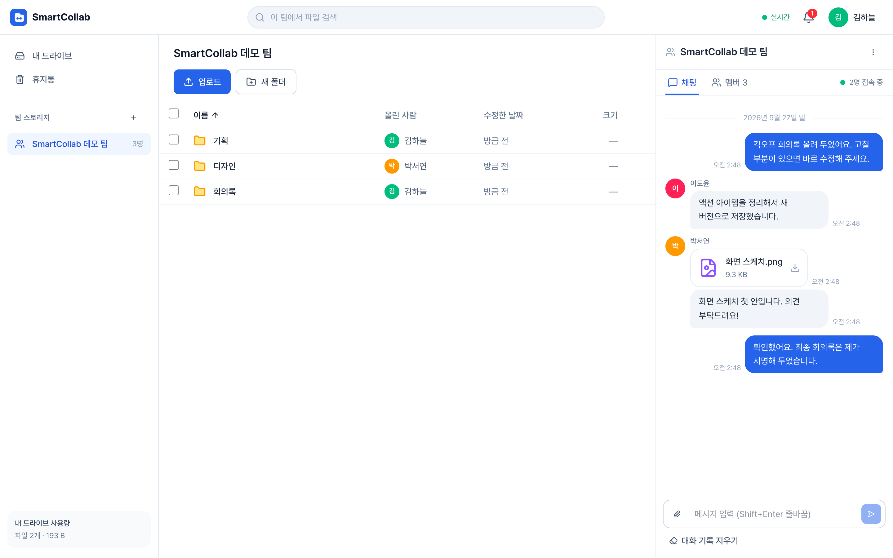
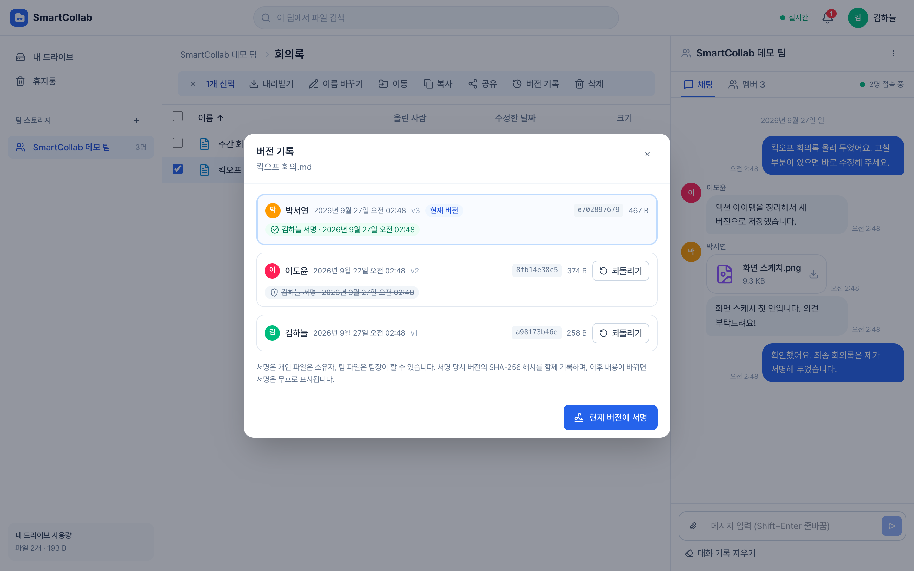
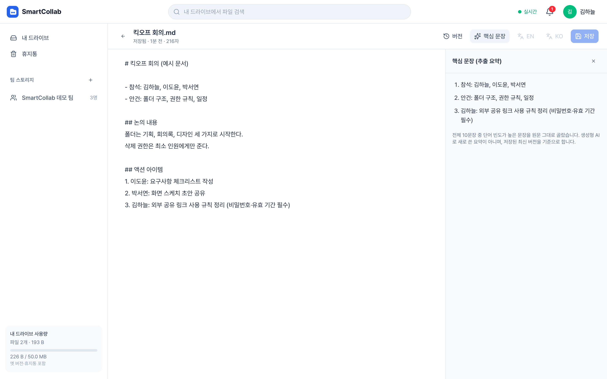
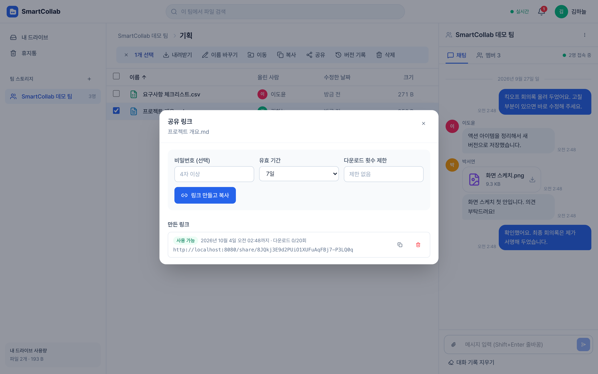
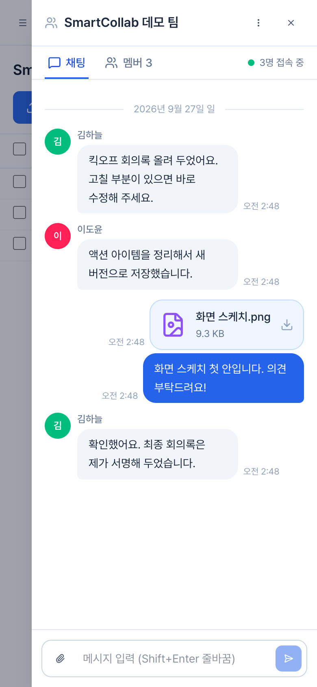
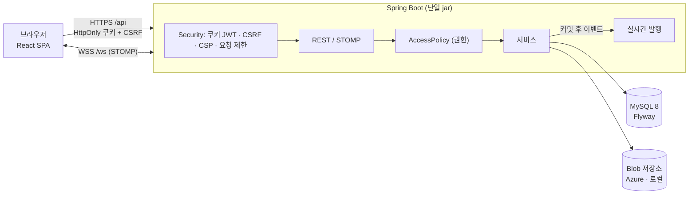

# SmartCollab — 팀을 위한 클라우드 파일 협업 공간

[](https://github.com/Jinyoung-Kang/Web_Smartcollab_Project_2025_v2/actions/workflows/ci.yml)

팀이 파일을 한 곳에 모으고, **권한을 나눠 관리하고, 수정 이력과 승인(서명)을 남기고, 채팅으로 바로 공유**하는 웹 서비스입니다.
대학 졸업 작품으로 기획부터 설계·프론트엔드·백엔드·DB·Azure 연동과 배포 구성까지 단독 개발했고, 이 저장소는 **최종 완성본(v2)** 입니다.
첫 완성본([v1](https://github.com/Jinyoung-Kang/Web_Smartcollab_Project_2025))의 모든 코드·메뉴·기능을 검토해 보안 결함과 버그를 고치고 아키텍처·성능·UI/UX 를 개선했으며, 기능을 다 만든 뒤에는 실무 코드 리뷰 기준으로 두 차례 더 점검해 1차 28건 중 21건, 2차 19건을 고쳤습니다.



| | |
|---|---|
| **백엔드** | Java 21 · Spring Boot 4.1 · Spring Security (쿠키 JWT·CSRF) · JPA/Hibernate 7 · Flyway · STOMP WebSocket |
| **프론트엔드** | React 19 · TypeScript · Vite · TanStack Query · Tailwind CSS 4 |
| **데이터·저장소** | MySQL 8 · Azure Blob Storage(또는 로컬 디스크) |
| **배포 구성** | Azure App Service(Docker 이미지 또는 jar) · Azure Database for MySQL · Azure Blob Storage — 절차는 [DEPLOYMENT](docs/DEPLOYMENT.md) |
| **CI·테스트** | GitHub Actions · JUnit 6 + Testcontainers(MySQL·Azurite) 219건 · Vitest 71건 · Playwright E2E 12건(접근성 자동 검사 포함) · ArchUnit 구조 규칙 |

---

## 첫 완성본(v1)에서 최종 완성본(v2)까지

| 구분 | 결과 | 자세히 |
|---|---|---|
| **보안** | 인증 없이 남의 파일을 열 수 있던 경로를 포함해 권한 결함 **14건** 수정 (IDOR, WebSocket 도청·사칭, 소스에 박힌 시스템 계정 비밀번호 등) | [REFACTORING_REPORT §1](docs/REFACTORING_REPORT.md#1-보안) |
| **버그** | 폴더·계정 삭제 실패, 복사본 다운로드 불가, 순환 이동 무한 재귀, 공유 링크 9시간 조기 만료, 동시 편집 덮어쓰기 등 **22건** 수정 | [REFACTORING_REPORT §2](docs/REFACTORING_REPORT.md#2-기능-결함) |
| **성능** | 폴더 62개 기준 트리 조회 SQL **63 → 1회**, 검색 **125 → 2회** · 32MB 다운로드 힙 할당 **100.7MB → 17KB** · 첫 화면 JS **1,156KB → 153KB**, 스크립트 실행 **540 → 35ms** | [PERFORMANCE](docs/PERFORMANCE.md) |
| **아키텍처** | 도메인별 패키지, 권한 판단 단일화(AccessPolicy), 저장소 전략 패턴 + 트랜잭션 연동, Flyway, 커밋 후 실시간 이벤트 | [ARCHITECTURE](docs/ARCHITECTURE.md) · [ADR](docs/adr/README.md) |
| **UI/UX** | URL 라우팅, 여러 파일 드래그 업로드·진행률, 휴지통·버전 서명·공유 링크 관리 화면, 편집 충돌 해결, 실시간 접속 표시, 반응형, 접근성 WCAG 2.1 AA 자동 검사 위반 0 | [REFACTORING_REPORT §4](docs/REFACTORING_REPORT.md#4-uiux) |
| **코드 리뷰 (1차)** | **28건** 발견(High 2 · Medium 9 · Low 17), **21건** 해결(보류 7건 중 6건은 2차 점검에서 해결) — 요청 제한 IP 위조 우회, 팀에서 제외된 사용자의 WebSocket 수신, 업로드 중 DB 커넥션 점유, 저장 공간 한도·체험 계정 보호 등 | [REVIEW_2026-09](docs/REVIEW_2026-09.md) |
| **2차 점검** | **19건** 해결 — 폴더도 휴지통으로(이전: 즉시 영구 삭제), 비로그인 대용량 요청 차단(본문 6MB), 사용자별 번역 분량, 요청 추적 ID·보안 이벤트 로그, CSP 인라인 스타일 금지, 5,000개 폴더 첫 표시 **1.45초 → 0.2초**, 여러 항목 삭제 요청 N → 1, 알림 조회 인덱스(2.2ms → 0.1ms), 접근성 위반 0, 오류 안내 화면 | [REVIEW_2026-09-28](docs/REVIEW_2026-09-28.md) |

모든 수치는 저장소의 테스트·스크립트로 측정한 값입니다 (원자료: [docs/measurements](docs/measurements)).

## 주요 기능

- **드라이브**: 개인·팀 스토리지, 폴더 트리, 여러 파일 업로드(드래그 앤 드롭·진행률·취소), 이동·복사(폴더는 하위까지), 이름 검색(경로 표시), 휴지통(파일·폴더, 30일 뒤 자동 삭제, 폴더는 안의 파일과 함께 복원), 저장 공간 한도(개인 1GB·팀 5GB, 옛 버전·휴지통 포함, 사이드바에 사용량 표시)
- **미리보기·편집**: 이미지·PDF·텍스트 미리보기, Office 문서(Azure 저장소일 때), 텍스트 편집기(저장 충돌 감지), 핵심 문장 추출 요약, DeepL 번역(키 설정 시)
- **버전·서명**: 저장할 때마다 버전과 SHA-256 기록, 되돌리기, 팀장·소유자 서명(내용이 바뀌면 자동 무효 표시)
- **팀 협업**: 초대·수락, 멤버별 편집·삭제·초대 권한, 팀장 위임, 실시간 채팅(파일 공유·미리보기), 접속 중 표시, 다른 사람의 변경 즉시 반영
- **외부 공유**: 비밀번호·유효 기간·다운로드 횟수 제한 링크, 링크 목록·해제, 로그인 없는 다운로드 페이지
- **알림**: 초대·권한 변경·팀장 위임 등을 WebSocket 으로 즉시 전달

| 버전 기록·서명 | 편집기·핵심 문장 요약 |
|---|---|
|  |  |
| **공유 링크 관리** | **모바일** |
|  |  |

## 아키텍처



배포 구성은 Azure App Service(Docker 이미지 또는 jar) + Azure Database for MySQL + Azure Blob Storage 입니다. 운영 프로필(`prod`)이 Azure 저장소·보안 쿠키를 켜고, 스키마는 기동 시 Flyway 가 만듭니다 → [docs/DEPLOYMENT.md](docs/DEPLOYMENT.md)

자세한 설계(데이터 모델, 권한 모델, 업로드·편집·실시간 흐름, 한계와 확장 방안)는 [docs/ARCHITECTURE.md](docs/ARCHITECTURE.md).

## 빠르게 실행하기

필요한 것: Docker

```bash
cp .env.example .env
# .env 에서 JWT_SECRET 을 32자 이상 무작위 값으로, 체험 데이터가 필요하면 DEMO_ENABLED=true · DEMO_PASSWORD=원하는값(영문+숫자 8자 이상)
docker compose up -d --build --wait
```

<http://localhost:8080> 에 접속합니다(8080 포트를 이미 쓰고 있다면 `.env` 의 `APP_PORT` 를 바꾸세요). 데모 모드라면 로그인 화면의 데모 계정(김하늘·이도윤·박서연)을 눌러 바로 체험할 수 있습니다. 여러 방문자가 함께 쓰는 체험 계정이라 탈퇴·팀 삭제 등은 막혀 있고, 저장 한도는 50MB 이며, 체험 데이터는 매일 05:00(한국 시각) 초기화됩니다.

### 개발 모드

```bash
docker compose up -d db                                   # MySQL (localhost:3307)
cd backend && DB_URL="jdbc:mysql://localhost:3307/smartcollab?serverTimezone=UTC" \
  DB_PASSWORD=smartcollab ./gradlew bootRun               # API :8080
cd frontend && npm ci && npm run dev                      # 화면 :5173 (API·WebSocket 프록시)
```

API 문서: <http://localhost:8080/swagger-ui.html> · 전체 목록 [docs/API.md](docs/API.md)

## 테스트

```bash
cd backend && ./gradlew test          # 219건 (MySQL·Azurite 컨테이너 자동 실행), 커버리지 리포트 포함
cd frontend && npm test               # 71건
docker compose up -d --wait && cd e2e && npm ci && npx playwright test   # E2E 12건 (접근성 자동 검사 포함)
```

백엔드 라인 커버리지 91.6%(분기 80.0%). 첫 완성본(v1)에서 찾은 결함마다 회귀 테스트가 있습니다 → [docs/TESTING.md](docs/TESTING.md)
GitHub Actions 가 PR 과 main 푸시마다 백엔드·프론트엔드·E2E(Docker 이미지)·비밀값 검사(gitleaks)를 실행합니다.
E2E 를 1분 안에 여러 번 돌리면 로그인 요청 제한에 걸리므로, 반복 실행 방법은 [TESTING](docs/TESTING.md) 을 참고하세요.

## 문서

| 문서 | 내용 |
|---|---|
| [REFACTORING_REPORT](docs/REFACTORING_REPORT.md) | 첫 완성본(v1) 검토 결과 — 보안 14 · 버그 22 · 성능 · UI/UX, 원인·해결·검증 테스트 |
| [ARCHITECTURE](docs/ARCHITECTURE.md) | 구성도, 패키지, 데이터·권한 모델, 주요 흐름, 한계 |
| [PERFORMANCE](docs/PERFORMANCE.md) | 측정 방법과 결과 |
| [SECURITY](docs/SECURITY.md) | 위협별 대응, 인증 흐름, 보안 헤더 |
| [API](docs/API.md) | 엔드포인트, 오류 코드, WebSocket |
| [TESTING](docs/TESTING.md) | 테스트 전략과 목록 |
| [DEPLOYMENT](docs/DEPLOYMENT.md) | 환경 변수, Azure 배포 구성(App Service·Database for MySQL·Blob Storage), CI |
| [ADR](docs/adr/README.md) | 주요 설계 결정 8건 |
| [REVIEW_2026-09](docs/REVIEW_2026-09.md) | 코드 리뷰 (1차) — 발견 28건(해결 21 · 보류 7)의 재현·원인·수정·검증 기록 |
| [REVIEW_2026-09-28](docs/REVIEW_2026-09-28.md) | 2차 점검 — 아키텍처·성능·보안(OWASP)·UI/UX 기준 재점검, 측정값과 변경 기록 |

## 폴더 구조

```
backend/    Spring Boot (도메인별 패키지: auth·file·folder·team·chat·share·storage·realtime …)
frontend/   React + TypeScript (api·realtime·features·components)
e2e/        Playwright E2E, 화면 캡처·성능 측정 스크립트
docs/       기술 문서, ADR, 측정 원자료, 화면
```

## 한계

단일 인스턴스를 전제로 합니다(인메모리 STOMP 브로커·요청 제한). 텍스트는 동시 편집 충돌을 감지하지만 여러 사람이 한 화면에서 동시에 입력하는 공동 편집은 아닙니다. 확장 방안은 [ARCHITECTURE §7](docs/ARCHITECTURE.md#7-한계와-확장-방안).
