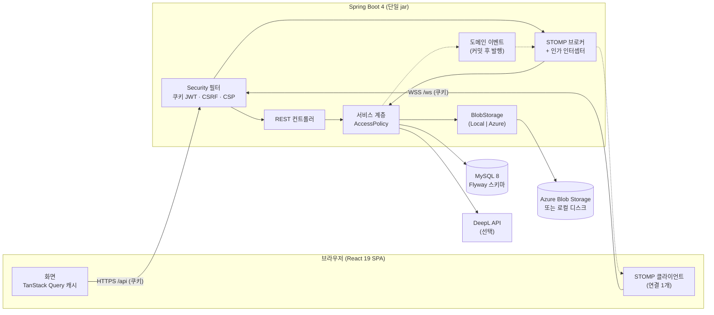
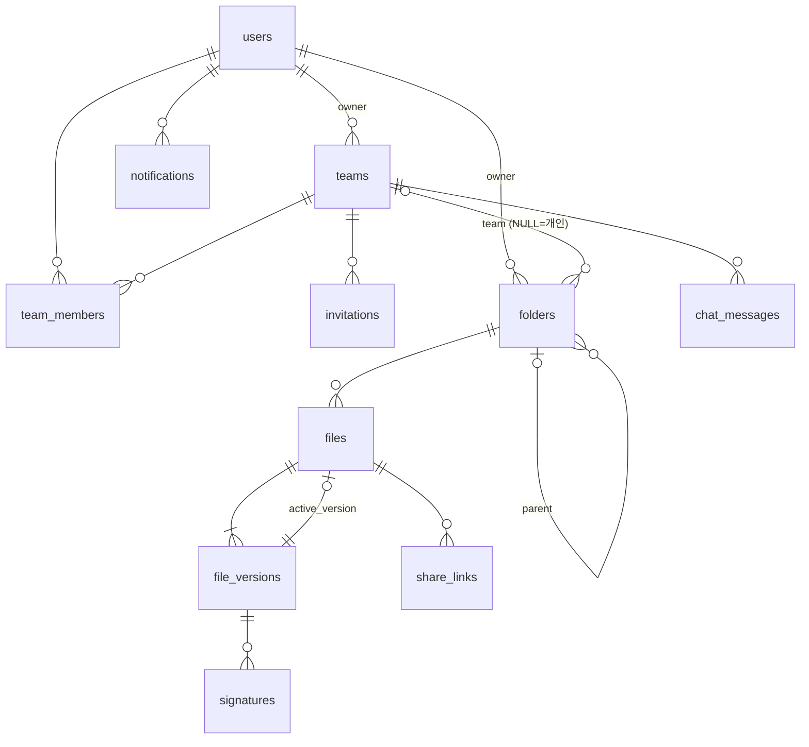
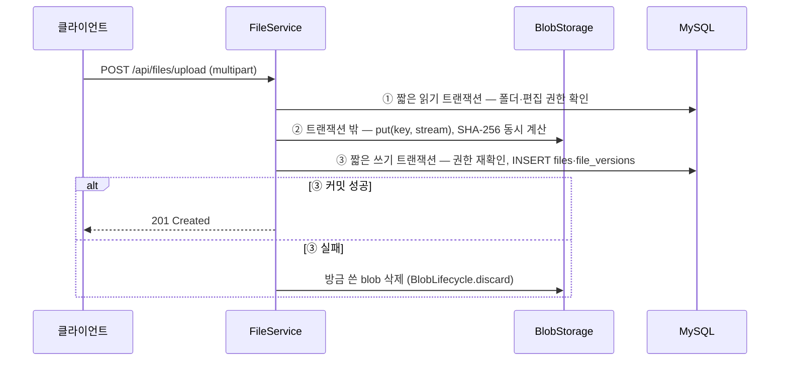
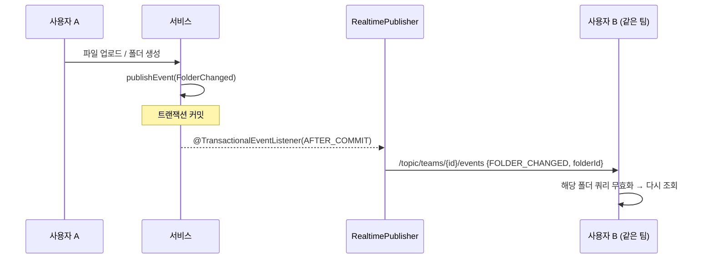

# 아키텍처

## 1. 전체 구성



- **한 개의 배포 단위**: Vite 로 빌드한 SPA 를 Spring Boot jar 의 `static/` 에 넣어 같은 출처(same-origin)로 제공합니다. CORS 가 필요 없고, 인증 쿠키를 `SameSite=Strict` 로 둘 수 있습니다.
- **상태 저장소**: MySQL(메타데이터), Blob 저장소(파일 바이트). 애플리케이션 서버는 인증 상태를 갖지 않습니다(JWT).
- **실시간**: Spring 의 SimpleBroker(인메모리). 단일 인스턴스 전제이며, 확장 방안은 §7.

## 2. 백엔드 패키지 (도메인별)

```
com.smartcollab
├── global      config · error(ProblemDetail) · security(JWT 쿠키, CSRF, 요청 제한, 보안 이벤트 로그)
│               · web(요청 추적 ID·접근 기록, 본문 크기 제한) · util
├── access      AccessPolicy — 파일·폴더·팀 권한 판단의 단일 진입점
├── auth / user 가입·로그인·탈퇴, 시스템 계정
├── folder      Folder, 재귀 CTE 조회, FolderTree(O(n) 트리)
├── file        업로드·다운로드·텍스트 편집·버전·휴지통·이동/복사·일괄 삭제
├── storage     BlobStorage(전략) · Local · Azure · BlobLifecycle(트랜잭션 연동)
├── team        팀·멤버·초대·권한
├── chat        커서 페이지 채팅, STOMP 컨트롤러
├── share       공유 링크, HMAC 다운로드 허가
├── signature   버전 서명
├── notification 알림
├── realtime    WebSocket 설정, STOMP 인가, 팀 구독 추적(접속 표시·권한 회수), 커밋 후 이벤트 발행
├── ai          추출 요약, 번역(사용자별 하루 분량 제한), DeepL 클라이언트
└── system      공개 설정, 데모 데이터
```

**의존 방향 규칙** (`ArchitectureTest`, ArchUnit 으로 빌드마다 검사): 컨트롤러는 리포지토리를 직접 쓰지 않고 서비스를 거칩니다.
서비스는 서블릿(HTTP) 타입을 모르고, 컨트롤러는 엔티티 대신 DTO 를 돌려줍니다. 공통 모듈(`global`)과 저장소 어댑터(`storage`)는
도메인 패키지에 의존하지 않습니다. 도메인 패키지끼리(file ↔ folder 등)는 서로 참조합니다 — 한 드라이브 기능을 이루는 밀접한
애그리거트라 억지로 떼어 내지 않았습니다.

**요청이 거치는 필터 순서**: `RequestTraceFilter`(추적 ID·접근 기록) → `RequestBodyLimitFilter`(본문 6MB) →
Spring Security(쿠키 JWT 인증·CSRF·보안 헤더) → 컨트롤러. 추적 필터가 가장 앞에 있어 413·401 같은 거절 응답에도 추적 ID 가 붙습니다.

v1 은 `controller/ service/ repository/ entity/ dto/` 로 계층만 나눠, 한 기능을 고치려면 다섯 폴더를 오가야 했고 권한 규칙이 서비스 4곳에 따로 흩어져 서로 달랐습니다.

## 3. 데이터 모델



- 스키마는 Flyway(`db/migration/V1__init_schema.sql`, `V2__notifications_recent_index.sql`)로 관리하고 JPA 는 `validate` 만 합니다.
- 모든 시각은 UTC(`DATETIME(6)`, `Instant`)로 저장하고 화면에서 사용자 시간대로 표시합니다.
- 인덱스는 조회 경로 기준: `files(folder_id, is_deleted)`, `chat_messages(team_id, message_id)`, `notifications(user_id, is_read, created_at)`(읽지 않은 수)·`(user_id, created_at, notification_id)`(최신순 목록), `team_members(team_id, user_id) UNIQUE` 등.
- `files ↔ file_versions` 는 서로를 참조하므로(현재 버전 포인터) 삭제 시 포인터를 먼저 끊습니다.

## 4. 권한 모델

| 스코프 | 읽기 | 편집 | 삭제 | 초대 | 팀 관리 |
|---|---|---|---|---|---|
| 개인 드라이브 | 소유자 | 소유자 | 소유자 | – | – |
| 팀 스토리지 | 모든 멤버 | `canEdit` | `canDelete` 또는 내가 올린 파일 | `canInvite` | 팀장 |

- 모든 판단은 `AccessPolicy` 한 곳에서 합니다. 읽을 수 없는 대상은 **404**(존재 여부 비공개), 읽을 수는 있지만 권한이 부족하면 **403**.
- 외부 공유 링크는 파일을 올린 사람 또는 팀장만 만들 수 있습니다(팀 자료 외부 유출 통제).
- 서명은 개인 파일은 소유자, 팀 파일은 팀장만.

## 5. 주요 흐름

### 5.1 업로드 — 저장소와 DB 의 일관성



저장소 쓰기(Azure 라면 네트워크 전송)를 트랜잭션 밖에 두어, 큰 파일을 올리는 동안 DB 커넥션을 붙잡지 않습니다. 처음에는 한 트랜잭션 안에서 썼는데, 측정해 보니 풀 크기만큼 업로드가 동시에 진행되면 다른 요청이 저장소 작업이 끝날 때까지 기다렸습니다(폴더 조회 1,482ms → 개선 후 56ms, [PERFORMANCE §4](PERFORMANCE.md#4-저장소-입출력과-db-커넥션)). 복사(`ItemTransferService.copy`)도 같은 3단계(계획 → 저장소 복사 → 저장)로 처리합니다.

삭제는 반대로 **DB 커밋이 끝난 뒤에만** 저장소에서 지웁니다(`BlobLifecycle.deleteAfterCommit`). 커밋 전에 지웠다가 롤백되면 "DB 에는 있는데 내용이 없는" 복구 불가 상태가 되기 때문입니다. 반대 경우(커밋 후 저장소 삭제 실패)는 고아 파일만 남아 사용자 데이터 정합성은 깨지지 않습니다.

### 5.2 텍스트 편집 — 낙관적 동시성 제어

1. `GET /content` → 내용 + 현재 `versionId`
2. `PUT /content {content, baseVersionId}` → 서버의 현재 버전과 다르면 **409 EDIT_CONFLICT**
3. 동시에 두 요청이 검사를 통과해도 `files.version`(JPA `@Version`)이 한쪽을 거절
4. 화면은 "최신 내용 불러오기(내 편집본은 클립보드) / 내 내용으로 새 버전 저장" 중 선택

잠금(비관적 락)을 쓰지 않은 이유: 편집 세션이 길고 대부분 충돌하지 않으므로, 충돌 시에만 사용자가 판단하는 편이 처리량과 경험 모두 낫습니다.

### 5.3 실시간 — 커밋 후 이벤트



롤백된 변경이 다른 사람 화면에 먼저 나타나지 않도록, 이벤트는 커밋 이후에만 나갑니다. 클라이언트는 이벤트에 데이터를 싣지 않고 "무엇이 바뀌었는지"만 받아 다시 조회하므로, 권한 검사가 항상 REST 한 경로를 거칩니다.

| 목적지 | 내용 | 구독 권한 |
|---|---|---|
| `/topic/teams/{id}/chat` | 채팅 메시지 | 팀 멤버 |
| `/topic/teams/{id}/events` | 폴더 변경·멤버 변경·팀 삭제·채팅 비움 | 팀 멤버 |
| `/topic/teams/{id}/presence` | 접속 중인 멤버 | 팀 멤버 |
| `/user/queue/notifications` | 개인 알림 | 본인 |
| `/user/queue/errors` | STOMP 처리 오류 | 본인 |

구독 권한은 SUBSCRIBE 순간에 검사되므로, 권한이 사라진 뒤의 수신은 따로 막습니다.
- 팀에서 제외·나가기·탈퇴가 커밋되면 `TeamSubscriptionTracker` 가 그 사용자의 해당 팀 구독을 브로커 레지스트리에서 해제합니다(연결은 유지되어 개인 알림은 계속 받음).
- 로그인(JWT)이 만료된 연결은 `WebSocketSessionExpiry` 가 1분 안에 닫고, 재연결할 때 다시 인증합니다.
- 클라이언트는 재연결하면 팀 목록을 다시 받아, 빠진 팀의 토픽을 다시 구독하지 않습니다.

### 5.4 공유 링크 다운로드

1. `GET /api/public/shares/{token}` — 파일명·크기·비밀번호 여부 (만료·소진·휴지통이면 410)
2. 비밀번호가 있으면 `POST …/unlock {password}` → 5분짜리 `grant = 만료시각.HMAC-SHA256(token|만료시각)` (링크+IP 기준 10분 10회, 링크 기준 10분 50회 제한)
3. `GET …/download?grant=` → 조건부 UPDATE 로 다운로드 횟수를 원자적으로 차감 후 스트리밍

## 6. 프론트엔드

```
frontend/src
├── api/          fetch 래퍼(CSRF·ProblemDetail→ApiError·401 처리), 엔드포인트, XHR 업로드
├── auth/         로그인·가입, 인증 상태
├── realtime/     STOMP 연결 1개(자동 재연결·구독 복원), 팀 이벤트 → 캐시 무효화
├── layout/       헤더·사이드바·반응형 셸
├── features/     drive · editor · team · notifications · share · account
├── components/ui 버튼, <dialog> 모달, 토스트, 확인창
└── lib/          포맷(바이트·상대시간·한국어 정렬), 아이콘, 미디어 쿼리
```

- 서버 상태는 TanStack Query 캐시에 두고, 실시간 이벤트는 캐시 무효화로만 반영합니다(단일 진실 공급원).
- 모달은 네이티브 `<dialog>` + `showModal()` 로 포커스 가두기·ESC·배경 비활성을 브라우저에 맡깁니다.
- 폴더가 바뀌면 `key` 로 화면 컴포넌트를 새로 만들어 선택·대화상자 상태를 초기화합니다(effect 로 상태를 되돌리지 않음).
- 넓은/좁은 화면용 패널을 CSS 로 숨기지 않고 `useMediaQuery` 로 한 쪽만 렌더링합니다(중복 요청 방지 — E2E 테스트가 발견).

## 7. 한계와 확장 방안

| 현재 | 한계 | 확장 시 |
|---|---|---|
| SimpleBroker(인메모리) | 인스턴스 2개 이상이면 서로 다른 서버의 구독자에게 메시지가 가지 않음 | RabbitMQ STOMP 릴레이 또는 Redis Pub/Sub |
| 요청 제한·접속자 추적 인메모리 | 인스턴스마다 따로 셈 | Redis |
| 로그아웃은 쿠키 삭제 | 탈취된 토큰은 만료(기본 8시간)까지 유효 | 토큰 버전·차단 목록 또는 짧은 액세스 토큰 + 리프레시 토큰 |
| 텍스트 동시 편집은 충돌 감지까지 | 실시간 공동 편집(여러 커서) 아님 | CRDT(Yjs 등) 도입 |
